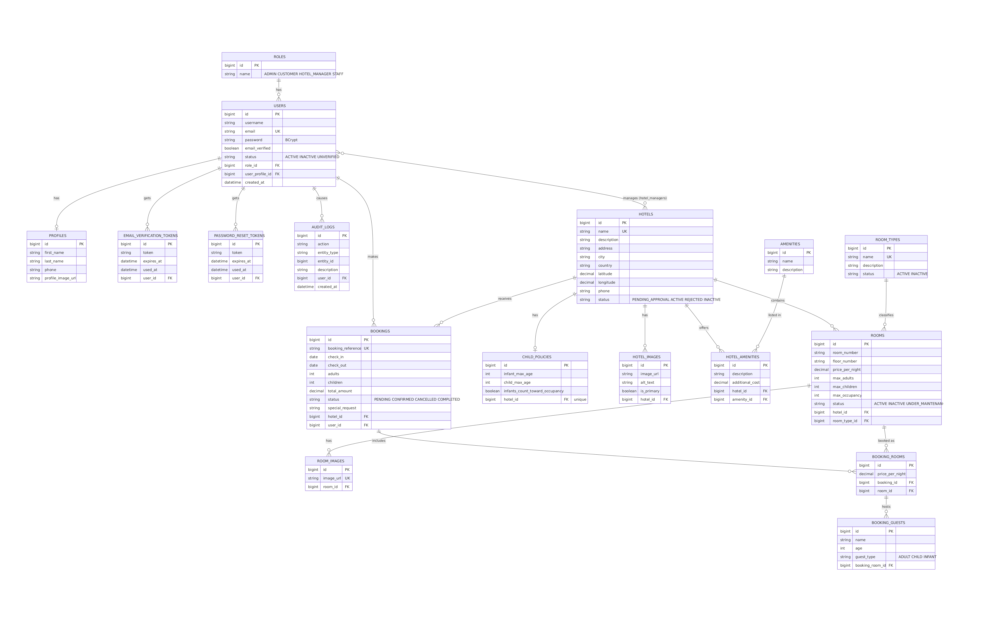

# VibeStay

## Project Description

VibeStay is a hotel reservation and management platform that allows users to discover hotels, check room availability, make bookings, and manage their reservations.

The system also gives hotel managers and administrators tools to manage hotels, rooms, and bookings.

I built VibeStay as a practical hotel booking application rather than just a collection of CRUD endpoints. The main focus is on the booking flow, room availability, user roles, validation, and the business rules around making and managing reservations.

## Application Purpose

The purpose of VibeStay is to provide a simple platform for managing hotel reservations while handling room availability, bookings, hotel management, and user management.

The application also focuses on preventing invalid bookings, such as booking a room that is already reserved for overlapping dates or exceeding the room's allowed capacity.

## Main Features

### User and Authentication
- User registration and login
- JWT authentication
- Email verification
- Forgot password
- Reset password
- Change password
- User profiles
- Profile picture upload
- Role-based access control
- Soft delete and inactive user handling

### Hotel Management
- Hotel creation and management
- Hotel manager assignment
- Hotel approval workflow
- Hotel status management
- Hotel images
- Hotel amenities
- Child policies
- Hotel search and filtering
- Pagination and sorting
- Hotel location using latitude and longitude

### Room Management
- Room management
- Room types
- Room capacity management
- Adult and child occupancy limits
- Room availability
- Multiple rooms in one booking
- Room status management

### Booking Management
- Hotel room booking
- Multiple rooms in one booking
- Guest information
- Guest age classification
- Booking reference generation
- Booking availability validation
- Booking capacity validation
- Booking total calculation
- Booking cancellation
- Booking status management
- View booking details
- View my bookings

### Notifications and Email
- Booking confirmation emails
- Booking status email notifications
- HTML booking emails
- Real-time booking notifications using WebSockets/STOMP
- Hotel location included in booking emails

### Security and API
- Spring Security
- JWT authentication
- Role-based authorization
- Password hashing
- Input validation
- Global exception handling
- Rate limiting for sensitive authentication endpoints
- Audit logging
- Swagger/OpenAPI documentation
- Pagination and sorting
- Search and filtering
- DTO-based API requests and responses

## Technologies

- Java
- Spring Boot
- Spring Security
- JWT
- PostgreSQL
- Maven
- Swagger/OpenAPI
- WebSockets
- STOMP
- Git/GitHub

## Architecture

The application follows a layered architecture:

```text
Controller
    ↓
Service
    ↓
Repository
    ↓
Database
```

I am using a code-first approach for implementing the application and database entities.

The project follows an MVC structure and uses DTOs to separate API requests and responses from database entities.

## User Stories

Project planning and user stories were managed using Jira.

[Jira Board](https://batooltaher124.atlassian.net/jira/software/projects/KAN/boards/1)

## ERD

The database structure was first designed in Lucidchart and then updated to match the final entities (rooms, room images, amenities, audit logs and tokens).

[View ERD on Lucidchart](https://lucid.app/lucidchart/8b0e637d-298f-47b5-a125-42f609a4f752/edit)



The diagram source is in `docs/erd.mmd` (Mermaid), so it can be edited and rendered again.

## Planning

The project was planned and tracked using Jira.

The planning included:
- Deliverables
- Timeline
- Scope
- Progress
- User stories
- Development tasks

## API Endpoints

Base URL: `http://localhost:8000`. "Public" means no token is needed. Everything else needs `Authorization: Bearer <token>`.
Lists accept `page`, `size` and `sort` (for example `?page=0&size=10&sort=name,asc`).

### Authentication and profile (`/auth/users`)

| Method | Path | Access | What it does |
|---|---|---|---|
| POST | `/auth/users` | Public | Register (profile photo is optional) |
| GET | `/auth/users/verify-email?token=` | Public | Verify email |
| POST | `/auth/users/login` | Public | Log in, returns the JWT |
| POST | `/auth/users/forgot-password` | Public | Send a password reset link |
| POST | `/auth/users/reset-link` | Public | Set a new password with the link token |
| POST | `/auth/users/change-password` | Logged in | Change my password |
| GET / PUT | `/auth/users/profile` | Logged in | View / update my profile |
| PUT | `/auth/users` | Logged in | Change my profile photo |

### Hotels (`/api/hotels`)

| Method | Path | Access | What it does |
|---|---|---|---|
| GET | `/api/hotels` | Public | Search live hotels (`search`, `name`, `city`, `country`) |
| GET | `/api/hotels/{id}` | Public | Hotel details with images, amenities and policy |
| POST | `/api/hotels` | Admin, Manager | Create a hotel (managers' hotels wait for approval) |
| PUT | `/api/hotels/{id}` | Admin, Manager | Update a hotel (managers: only their own) |
| GET | `/api/hotels/my-hotels` | Manager | Hotels I manage |
| GET | `/api/hotels/pending` | Admin | Hotels waiting for approval |
| PATCH | `/api/hotels/{id}/status` | Admin | Approve, reject, activate or deactivate |
| POST | `/api/hotels/{hotelId}/managers/{managerId}` | Admin | Assign a manager to a hotel |
| GET / POST / DELETE | `/api/hotels/{hotelId}/images[/{imageId}]` | Public / Admin, Manager | List, upload and delete hotel photos |
| GET | `/api/hotels/{hotelId}/child-policy` | Public | View the child policy |
| POST / PUT | `/api/hotels/{hotelId}/child-policy` | Admin, Manager | Create / update the child policy |

### Rooms and room types

| Method | Path | Access | What it does |
|---|---|---|---|
| POST | `/api/hotels/{hotelId}/rooms` | Admin, Manager | Add a room |
| POST | `/api/hotels/{hotelId}/rooms/bulk` | Admin, Manager | Add up to 100 rooms at once (all or nothing) |
| GET | `/api/hotels/{hotelId}/rooms` | Admin, Manager | List rooms |
| GET / PUT | `/api/hotels/{hotelId}/rooms/{roomId}` | Admin, Manager | View / update one room |
| PATCH | `/api/hotels/{hotelId}/rooms/{roomId}/status` | Admin, Manager | ACTIVE, INACTIVE or UNDER_MAINTENANCE (blocked if the room has upcoming bookings) |
| GET | `/api/hotels/{hotelId}/rooms/{roomId}/images` | Public | Room photos |
| POST / DELETE | `/api/hotels/{hotelId}/rooms/{roomId}/images[/{imageId}]` | Admin, Manager | Upload / delete room photos |
| GET | `/api/rooms-types`, `/api/rooms-types/{id}` | Admin, Manager | Room types |
| POST / PUT / PATCH | `/api/rooms-types[/{id}[/status]]` | Admin | Create, update, activate or deactivate room types |

### Amenities

| Method | Path | Access | What it does |
|---|---|---|---|
| GET | `/api/amenities` | Public | The amenity catalog |
| POST | `/api/amenities` | Admin, Manager | Add an amenity to the catalog |
| PUT / DELETE | `/api/amenities/{id}` | Admin | Rename / delete (not allowed while a hotel uses it) |
| POST | `/api/hotels/{hotelId}/amenities` | Admin, Manager | Add an amenity to a hotel (description, extra cost) |
| PUT / DELETE | `/api/hotels/{hotelId}/amenities/{amenityId}` | Admin, Manager | Change / remove it |

### Availability and bookings

| Method | Path | Access | What it does |
|---|---|---|---|
| POST | `/api/availability/search` | Public | Find hotels and rooms free for the dates and guests |
| POST | `/api/bookings` | Logged in | Create a booking (one or more rooms, guests with ages) |
| GET | `/api/bookings/my-bookings` | Customer | My bookings |
| GET | `/api/bookings/{bookingId}` | Customer, Manager, Admin | Booking details (own booking, own hotel, or any for admin) |
| PATCH | `/api/bookings/{bookingId}/cancel` | Customer, Manager, Admin | Cancel a confirmed booking |
| PATCH | `/api/bookings/{bookingId}/status` | Manager, Admin | Mark a booking COMPLETED |

### Admin

| Method | Path | Access | What it does |
|---|---|---|---|
| GET | `/api/admin/users` | Admin | Users with filters `status`, `role`, `search`, paging and sorting |
| GET | `/api/admin/users/{id}` | Admin | One user |
| PATCH | `/api/admin/users/{id}/status` | Admin | Activate / deactivate a user |
| DELETE | `/api/admin/users/{id}` | Admin | Deactivate a user (soft delete, data is kept) |

Errors always use the same JSON shape: `timestamp`, `status`, `error`, `message`, `path` (and an `errors` map for validation problems).

## API Documentation

Swagger/OpenAPI is used to document and test the REST API.

When running the application locally, Swagger UI is available at:

```text
http://localhost:8000/swagger-ui/index.html
```

## Installation

### 1. Clone the repository

```bash
git clone https://github.com/Batool-Isa/hotel-booking-system.git
cd hotel-booking-system
```

### 2. Configure PostgreSQL

Create a PostgreSQL database for the application and configure the database connection.

### 3. Configure Environment Variables and Profiles

Secrets are never stored in the repository. Set them as environment variables (see `.env.example`):

| Variable | Purpose |
| --- | --- |
| `SPRING_PROFILES_ACTIVE` | `dev` (default), `test` or `prod` |
| `DATABASE_URL` | JDBC url, e.g. `jdbc:postgresql://localhost:5432/hotel-booking-app` |
| `DATABASE_USERNAME` / `DATABASE_PASSWORD` | PostgreSQL credentials |
| `JWT_SECRET` | Base64 signing key, at least 32 bytes (`openssl rand -base64 48`) |
| `JWT_EXPIRATION_MS` | Token lifetime, default 86400000 (24 h) |
| `EMAIL_USERNAME` / `EMAIL_PASSWORD` | SMTP account (Gmail app password) |
| `GOOGLE_MAPS_API_KEY` | Optional, for the static map in emails |

Spring profiles:

| Profile | Database | Notes |
| --- | --- | --- |
| `dev` | local PostgreSQL | SQL logging on, DEBUG logs |
| `test` | in-memory H2 | used by the automated tests, needs no secrets |
| `prod` | PostgreSQL from env vars | SQL logging off, quiet logs |

Stack traces are never returned in API responses in any profile.

### 4. Seed the Database

On start, the application fills an empty database with demo data. It checks before every insert, so restarting never creates duplicates. To get a completely fresh set, drop and recreate the database.

| What | Demo data |
|---|---|
| Roles | ADMIN, CUSTOMER, HOTEL_MANAGER, STAFF |
| Users | `admin@vibestay.com` (`Admin123!`), `staff1@vibestay.com` (`Staff123!`), `manager1` to `manager6@vibestay.com` (`Manager123!`), `customer1` to `customer16@vibestay.com` (`Customer123!`) |
| Hotels | 11 hotels in Bahrain, UAE, Qatar, Saudi Arabia, Oman and Kuwait: 8 ACTIVE, 2 PENDING_APPROVAL, 1 INACTIVE |
| Per hotel | a manager, a child policy, 2 to 8 amenities with descriptions and extra costs, and 11 rooms |
| Room types | Standard, Twin, Deluxe, Executive Suite, Family Suite, Presidential Suite |
| Amenities | 16 (Wi-Fi, Pool, Gym, Spa, Breakfast, Airport Shuttle, Kids Club ...) |
| Bookings | 26 bookings (`SEED-0001` ...) with guests: upcoming, completed and cancelled |

These passwords are fake demo values for development only. Change them before any real deployment.

### 5. Start the Application

The application can be started using IntelliJ or Maven:

```bash
./mvnw spring-boot:run
```

### 6. Access the API

The application runs locally on:

```text
http://localhost:8000
```

### 7. Access Swagger

```text
http://localhost:8000/swagger-ui/index.html
```

## WebSocket

VibeStay uses WebSockets with STOMP for real-time booking notifications.

```text
ws://localhost:8000/ws
```

**Security.** A browser cannot send an `Authorization` header while opening a WebSocket, so the JWT is sent in the STOMP `CONNECT` frame (`Authorization: Bearer <token>`). The server checks the token and that the account is active; without a valid token the connection is refused. Every `SUBSCRIBE` is checked, and clients cannot publish messages.

**Who receives what.**

| Destination | Who can subscribe | What they get |
|---|---|---|
| `/user/queue/bookings` | any logged-in user | their own booking events (private) |
| `/topic/hotels/{hotelId}/bookings` | the managers of that hotel, and admins | events of that hotel |
| `/topic/admin/bookings` | admins | all booking events |

A message looks like:

```json
{ "bookingReference": "VB1A2B", "message": "Booking confirmed successfully", "status": "CONFIRMED", "hotelId": 1, "hotelName": "VibeStay Manama Grand" }
```

Events are sent when a booking is confirmed, cancelled or completed. `websocket-test.html` is a small client: paste a JWT from `/auth/users/login`, connect, and watch the events arrive without refreshing.

## Email Notifications

VibeStay sends booking-related email notifications.

The booking email includes:
- Booking reference
- Hotel information
- Check-in and check-out dates
- Guest information
- Room information
- Booking status
- Number of nights
- Total amount
- Hotel location
- Google Maps location

The email is generated as HTML to make the booking information easier to read.

## Major Challenges

### Booking Availability

One of the main challenges was handling room availability.

Before creating a booking, the application checks whether the selected room already has an overlapping booking.

The overlap rule is:

```text
existing check-in < requested check-out
AND
existing check-out > requested check-in
```

This prevents conflicting reservations while still allowing a new guest to check in on the same day another guest checks out.

### Booking and Guest Relationships

A booking can contain multiple rooms, and each booked room can contain multiple guests.

The relationship is structured as:

```text
User
  ↓
Booking
  ↓
BookingRoom
  ↓
Room

BookingRoom
  ↓
BookingGuest
```

This allowed me to keep guest information connected to the specific room they are staying in.

### Guest Age Classification

Guests are classified based on the hotel's child policy.

The system handles:
- Adults
- Children
- Infants

The policy also determines whether infants count towards room occupancy.

### Role-Based Authorization

VibeStay has different roles with different permissions:
- CUSTOMER
- HOTEL_MANAGER
- ADMIN
- STAFF (role exists and is seeded, reserved for future features)

For example, customers can manage their own bookings, hotel managers can manage hotels assigned to them, and administrators can perform system-level management actions.

### Real-Time Notifications

WebSocket/STOMP was one of the features I had to spend time debugging and testing.

The application sends a real-time notification when booking events occur, such as a booking being confirmed or cancelled.

At first every booking event went to one shared topic that anyone could join. I changed it so the JWT is checked when the socket connects, guests get their own private queue, and managers can only listen to hotels they manage.

I also created a small browser-based test client to demonstrate that the notification can be received without refreshing the page.

### Email and HTML Formatting

Another challenge was building a structured HTML email containing booking information.

The email dynamically displays booking details, hotel information, rooms, guests, total price, and the hotel's location.

The Google Maps Static API was also integrated into the email so the hotel location can be displayed as a map.

## Unsolved Problems

- Google Maps Static API requires billing to be enabled on the Google Cloud project before the map image can be displayed.
- More advanced concurrency handling for simultaneous booking attempts can be added in a future iteration.

## Resources Used

- [Spring Boot - Sending Email via SMTP](https://www.geeksforgeeks.org/springboot/spring-boot-sending-email-via-smtp/)
- [Spring Boot Logging](https://www.geeksforgeeks.org/springboot/spring-boot-logging/)

## Future Improvements

If I had more time, I would like to extend VibeStay with:
- A frontend application for customers and hotel managers
- Online payment integration
- AI-powered hotel recommendations or an AI booking assistant
- Improved Google Maps and location-based hotel search
- More advanced booking concurrency handling
- User-specific real-time notifications
- Reviews and ratings
- Hotel and booking analytics
- A more complete admin dashboard
- Advanced hotel and room search
- Mobile application support

## Project Status

VibeStay is currently being developed as a Spring Boot hotel reservation and management application.

The core authentication, hotel, room, booking, notification, email, and real-time functionality has been implemented. Additional improvements and frontend features can be added as the project continues.
